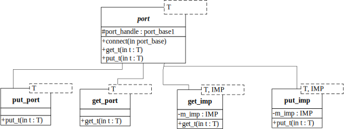

对于put_port/put_export;  get_port/get_export的模型前面都有介绍,对于这样的直接连接，函数调用的**initiator**直接指向最终target，不耗费仿真Delta时间。而UVM_TLM_FIFO的引入，提供了内部的put/get的实现同步机制，让消费者和生产者都可以通过port直接调用。不过，带来的效果是:get/put的同步是在tlm_fifo内部的进程进行实现的，通过**mailbox**的同步机制来达成，所以会消耗Delta时间。

一个简化的uvm_tlm_fifo实现程序，便于理解tlm_fifo背后的机制。

`类图:`



`源代码如下：`

```verilog
/**
 ** tlm_fifo.sv 
 ** 说明： 通过简单的模型来阐述 UVM/OVM中TLM uvm_tlm_fifo
 **       的基本原理。直接编译运行即可。
 ** 作者：http://electron64.blog.163.com
 */
virtual class port_base#(type T=int) ; // 构造一个抽象类
  typedef port_base#(T) this_type;
  protected this_type port_handle; // 申明一个对象句柄（指针）

  virtual task get_t(output T trans);
  endtask  // 虚函数，get_port和get_imp都必须以它为基类
  virtual task put_t(T trans); // 虚函数，put_port和put_imp都必须以它为基类
  endtask
  function void connect(this_type port); // connect仅仅是实现对象句柄的赋值
    port_handle = port;
  endfunction // connect

endclass // port_base
////////////////////////////////////////////////////////////
class get_port#(type T=int) extends port_base#(T);
  virtual task get_t(output T trans);
    port_handle.get_t(trans);
  endtask // get_t
endclass // get_port
/////////////////////////////////////////////////////////////////
class get_imp#(type T=int, type IMP=int) extends port_base#(T);
  local IMP m_imp;  // imp表示具体实现get_t()函数的对象句柄。
  function new(IMP imp);
    m_imp = imp;
  endfunction // new

  virtual task get_t(output T trans);
    m_imp.get_t(trans);  // 调用实现对象对应的get_t()函数
  endtask // get_t

endclass // get_imp
///////////////////////////////////////////////////////
class put_port#(type T=int) extends port_base#(T);
  virtual task put_t(T trans);
    port_handle.put_t(trans);
  endtask // put_t
endclass // put_port

class put_imp#(type T=int, type IMP=int) extends port_base#(T); 
  local IMP m_imp;  // imp表示具体实现put_t()函数的对象句柄。
  function new(IMP imp);
    m_imp = imp;
  endfunction // new
  
  virtual task put_t(T trans);
    m_imp.put_t(trans);  // 调用实现对象对应的put_t()函数
  endtask // put_t
////////////////////////////////////////////
endclass // put_imp

class tlm_fifo#(type T=int);
  typedef tlm_fifo#(T) this_type;
  put_imp#(T,this_type) put_export;
  get_imp#(T,this_type) get_export;

  local mailbox #(T) m;
  
  function new();
    m = new(1);
    put_export = new(this);
    get_export = new(this);
  endfunction // new
  
  virtual task put_t(T trans);
    m.put(trans);
`ifdef VERBOSE
    $display("[tlm_fifo.put_t]: Generate transaction:%d", trans);
`endif 
  endtask // put_t
  
  virtual task get_t(output T trans); 
    m.get(trans);
`ifdef VERBOSE
    $display("[tlm_fifo.get_t]: Get transaction:%d", trans);
`endif 
 endtask // get_t
endclass // tlm_fifo

//////////////////////////////////////////////////
class producer;
  put_port#(int) m_put_port;
  function new();
    m_put_port = new();
  endfunction // new
  
  task run(int num=10);
    int trans;
    for(int i=0; i<num; i++) begin  // 顺序产生10个int类型的transaction.
      trans = $random;
      #5 m_put_port.put_t(trans);
      $display("@%0t [Producer]: Generate transaction:<%0d>", $time, trans);
    end
  endtask // run
endclass // producer
////////////////////////////////////////////////////////////
class consumer;
  get_port#(int)  m_get_port;
  function new();
    m_get_port = new();
  endfunction // new

  task run(int num=10);
    int t;
    t = -1;
    for(int i=0; i<num; i++) begin  // 顺序产生10个int类型的transaction.
      #i  m_get_port.get_t(t);
      $display("@%0t [Consumer]: Get transaction:@{%0d}@", $time, t);
    end
  endtask // run 
endclass // consumer
//////////////////////////////////////////////////
module top;
  producer p;
  consumer c;
  tlm_fifo f;
  initial begin
    p = new();
    c = new();
    f = new();
    c.m_get_port.connect(f.get_export);  //通过句柄赋值进行连接
    p.m_put_port.connect(f.put_export); 
    fork 
      c.run();
      p.run();
    join
    #10 $finish;
  end
endmodule
```

