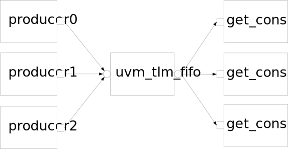

在TLM based的验证环境中，往往会碰到这样的需求：将来自不同地方的数据源进行统一处理。比如在USB的物理层driver建模中，packet来自不同的device，在物理层统一发送出去。 

TLM的建模方式提供了多对一的连接方式，为了演示这个功能，特此写了一个小程序。 

程序的结构如下： 



声明了一个fifo, fifo的get_export, put_export都有3个连接。 

为了区分不同的producer, 在producer class中用到了静态变量，每次例化一个相同的类，静态变量都会增加1. 而各自的pkt会记录当时的静态变量值，作为producer产生的transaction值。 源程序如下： 

```verilog
/***************************************************************
 * Filename        : multi_connect.sv
 * Author          : Zhu,YH
 * Created On      : Mon May 28 04:53:14 2012
 * Description     : multiple port connect to export.
 **************************************************************
 * Revision History : Initialized On Mon May 28 04:53:25 2012
 *
 **************************************************************/
`include "uvm_macros.svh"
import uvm_pkg::*;
class producer extends uvm_component;
  static int num = 0;
  int pkt;
  
  uvm_blocking_put_port#(int) pkt_put_port;

  function new(string name = "", uvm_component parent);
    super.new(name, parent);
    pkt = num++;
  endfunction:new

  function void build_phase(uvm_phase phase);
    super.build_phase(phase);
    pkt_put_port = new("put_port",this);
  endfunction:build_phase

  task main_phase(uvm_phase phase);
    phase.raise_objection(this);
    for(int i = 0; i<5; i++) begin
      int delay;
      delay = $urandom(10);
      #delay;
      `uvm_warning(get_full_name(), $sformatf("put item:%0d", pkt))
      pkt_put_port.put(pkt);
    end
    phase.drop_objection(this);
  endtask:main_phase

  
endclass:producer

class consumer extends uvm_component;
  uvm_blocking_get_port pkt_get_port;
  
  function new(string name = "", uvm_component parent);
    super.new(name, parent);
  endfunction:new
  
  function void build_phase(uvm_phase phase);
    super.build_phase(phase);
    pkt_get_port = new("get_port",this);
  endfunction:build_phase

  task main_phase(uvm_phase phase);
    phase.raise_objection(this);
    for(int i=0; i<5; i++) begin
      int pkt;
      int delay;
      delay = $urandom(10);
      #delay;
      pkt_get_port.get(pkt);
      `uvm_warning(get_full_name(), $sformatf("Got item:%0d",pkt))
    end
    phase.drop_objection(this);
  endtask:main_phase
endclass:consumer

class test extends uvm_test;

  uvm_tlm_fifo#(int) fifo;

  producer p[3];
  consumer c[3];
  `uvm_component_utils(test)

  
  function new(string name = "", uvm_component parent);
    super.new(name, parent);
  endfunction:new

  function void build_phase(uvm_phase phase);
    super.build_phase(phase);
    fifo = new("fifo", this, 20);
    for(int i=0; i<3; i++) begin
      c[i] = new($sformatf("consumer%0d", i), this);
      p[i] = new($sformatf("producer%0d", i), this);
    end
  endfunction:build_phase

  function void connect_phase(uvm_phase phase);
    for(int i=0; i<3; i++) begin
      c[i].pkt_get_port.connect(fifo.get_export);
      p[i].pkt_put_port.connect(fifo.put_export);
    end
  endfunction:connect_phase

endclass:test

module multi_connect(/*AUTOARG*/) ;

  initial begin
    run_test("test");
  end
  
endmodule
```

>
>
>运行结果如下:
>
>\# UVM-1.1 
>
>\# (C) 2007-2011 Mentor Graphics Corporation 
>
>\# (C) 2007-2011 Cadence Design Systems, Inc. 
>
>\# (C) 2006-2011 Synopsys, Inc. 
>
>\# (C) 2011      Cypress Semiconductor Corp. 
>
>\# ---------------------------------------------------------------- 
>
>\# UVM_INFO @ 0: reporter [RNTST] Running test test... 
>
>\# UVM_WARNING multi_connect.sv(34) @ 1373569184: uvm_test_top.producer2 [uvm_test_top.producer2] put item:2 
>
>\# UVM_WARNING multi_connect.sv(34) @ 1373569184: uvm_test_top.producer1 [uvm_test_top.producer1] put item:1 
>
>\# UVM_WARNING multi_connect.sv(34) @ 1373569184: uvm_test_top.producer0 [uvm_test_top.producer0] put item:0 
>
>\# UVM_WARNING multi_connect.sv(63) @ 1373569184: uvm_test_top.consumer2 [uvm_test_top.consumer2] Got item:2 
>
>\# UVM_WARNING multi_connect.sv(63) @ 1373569184: uvm_test_top.consumer1 [uvm_test_top.consumer1] Got item:1 
>
>\# UVM_WARNING multi_connect.sv(63) @ 1373569184: uvm_test_top.consumer0 [uvm_test_top.consumer0] Got item:0 
>
>\# UVM_WARNING multi_connect.sv(34) @ 2747138368: uvm_test_top.producer2 [uvm_test_top.producer2] put item:2 
>
>\# UVM_WARNING multi_connect.sv(34) @ 2747138368: uvm_test_top.producer1 [uvm_test_top.producer1] put item:1 
>
>\# UVM_WARNING multi_connect.sv(34) @ 2747138368: uvm_test_top.producer0 [uvm_test_top.producer0] put item:0 
>
>\# UVM_WARNING multi_connect.sv(63) @ 2747138368: uvm_test_top.consumer2 [uvm_test_top.consumer2] Got item:2 
>
>\# UVM_WARNING multi_connect.sv(63) @ 2747138368: uvm_test_top.consumer1 [uvm_test_top.consumer1] Got item:1 
>
>\# UVM_WARNING multi_connect.sv(63) @ 2747138368: uvm_test_top.consumer0 [uvm_test_top.consumer0] Got item:0 
>
>\# UVM_WARNING multi_connect.sv(34) @ 4120707552: uvm_test_top.producer2 [uvm_test_top.producer2] put item:2 
>
>\# UVM_WARNING multi_connect.sv(34) @ 4120707552: uvm_test_top.producer1 [uvm_test_top.producer1] put item:1 
>
>\# UVM_WARNING multi_connect.sv(34) @ 4120707552: uvm_test_top.producer0 [uvm_test_top.producer0] put item:0 
>
>\# UVM_WARNING multi_connect.sv(63) @ 4120707552: uvm_test_top.consumer2 [uvm_test_top.consumer2] Got item:2 
>
>\# UVM_WARNING multi_connect.sv(63) @ 4120707552: uvm_test_top.consumer1 [uvm_test_top.consumer1] Got item:1 
>
>\# UVM_WARNING multi_connect.sv(63) @ 4120707552: uvm_test_top.consumer0 [uvm_test_top.consumer0] Got item:0 
>
>\# UVM_WARNING multi_connect.sv(34) @ 5494276736: uvm_test_top.producer2 [uvm_test_top.producer2] put item:2 
>
>\# UVM_WARNING multi_connect.sv(34) @ 5494276736: uvm_test_top.producer1 [uvm_test_top.producer1] put item:1 
>
>\# UVM_WARNING multi_connect.sv(34) @ 5494276736: uvm_test_top.producer0 [uvm_test_top.producer0] put item:0 
>
>\# UVM_WARNING multi_connect.sv(63) @ 5494276736: uvm_test_top.consumer2 [uvm_test_top.consumer2] Got item:2 
>
>\# UVM_WARNING multi_connect.sv(63) @ 5494276736: uvm_test_top.consumer1 [uvm_test_top.consumer1] Got item:1 
>
>\# UVM_WARNING multi_connect.sv(63) @ 5494276736: uvm_test_top.consumer0 [uvm_test_top.consumer0] Got item:0 
>
>\# UVM_WARNING multi_connect.sv(34) @ 6867845920: uvm_test_top.producer2 [uvm_test_top.producer2] put item:2 
>
>\# UVM_WARNING multi_connect.sv(34) @ 6867845920: uvm_test_top.producer1 [uvm_test_top.producer1] put item:1 
>
>\# UVM_WARNING multi_connect.sv(34) @ 6867845920: uvm_test_top.producer0 [uvm_test_top.producer0] put item:0 
>
>\# UVM_WARNING multi_connect.sv(63) @ 6867845920: uvm_test_top.consumer2 [uvm_test_top.consumer2] Got item:2 
>
>\# UVM_WARNING multi_connect.sv(63) @ 6867845920: uvm_test_top.consumer1 [uvm_test_top.consumer1] Got item:1 
>
>\# UVM_WARNING multi_connect.sv(63) @ 6867845920: uvm_test_top.consumer0 [uvm_test_top.consumer0] Got item:0 
>
>\#  
>
>\# --- UVM Report Summary --- 
>
>\#  
>
>\# ** Report counts by severity 
>
>\# UVM_INFO :    1 
>
>\# UVM_WARNING :   30 
>
>\# UVM_ERROR :    0 
>
>\# UVM_FATAL :    0 
>
>\# ** Report counts by id 
>
>\# [RNTST]     1 
>
>\# [uvm_test_top.consumer0]     5 
>
>\# [uvm_test_top.consumer1]     5 
>
>\# [uvm_test_top.consumer2]     5 
>
>\# [uvm_test_top.producer0]     5 
>
>\# [uvm_test_top.producer1]     5 
>
>\# [uvm_test_top.producer2]     5